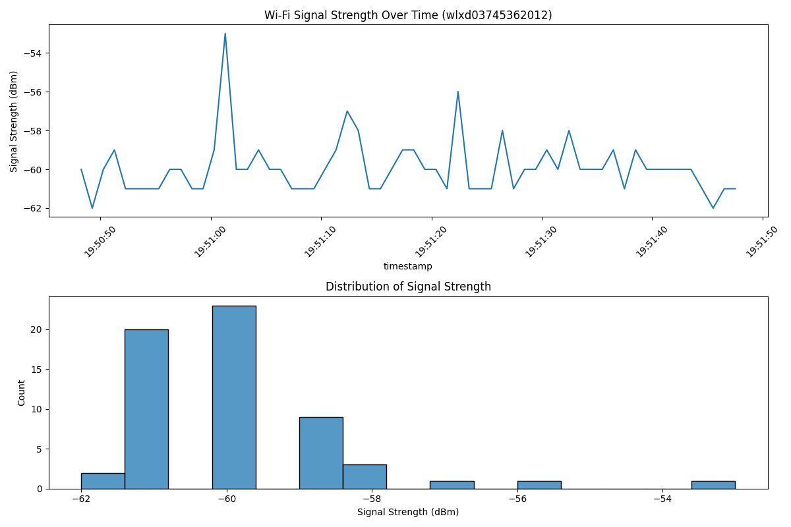

# wifi-mapper
maps Wi-Fi signal strength using your wireless adapter


This script will:

1. Collect Wi-Fi signal strength measurements using the iwconfig command
2. Store measurements with timestamps
3. Create visualizations including:
    - A time series plot showing signal strength over time
    - A distribution plot showing the range of signal strengths
4. Calculate basic statistics


## sample output

```bash
# python3 wifi_mapper.py 
```
```bash
Available wireless interfaces:
1. mywifi1
   Details: 1. mywifi1  IEEE 802.11  ESSID:"mynetwork"  
          Mode:Managed  Frequency:5.805 GHz  Access Point: some:number:...   
          Bit Rate=144.4 Mb/s   Tx-Power=20 dBm   
          Retry short limit:7   RTS thr:off   Fragment thr:off
          Power Management:off
          Link Quality=46/70  Signal level=-64 dBm  
          Rx invalid nwid:0  Rx invalid crypt:0  Rx invalid frag:0
          Tx excessive retries:0  Invalid misc:0   Missed beacon:0

2. mywifi2-adapter
   Details: mywifi2-adapter  IEEE 802.11  ESSID:"mynetwork"  
          Mode:Managed  Frequency:2.412 GHz  Access Point: some:number:.....  
          Bit Rate=39 Mb/s   Tx-Power=17 dBm   
          Retry short limit:7   RTS thr=2347 B   Fragment thr:off
          Power Management:off
          Link Quality=50/70  Signal level=-60 dBm  
          Rx invalid nwid:0  Rx invalid crypt:0  Rx invalid frag:0
          Tx excessive retries:0  Invalid misc:36   Missed beacon:0

*** TP-Link adapter detected at option 2 ***

TP-Link adapter automatically detected. Using interface: mywifi2-adapter

Using interface: mywifi2-adapter
Starting Wi-Fi signal strength mapping...
Collecting measurements for 1 minute...
Collected 60 measurements. Creating visualizations...

Signal Strength Statistics:
Average: -59.9 dBm
Maximum: -53 dBm
Minimum: -62 dBm

Visualization saved as 'wifi_signal_analysis_mywifi2-adapter.png'
```

